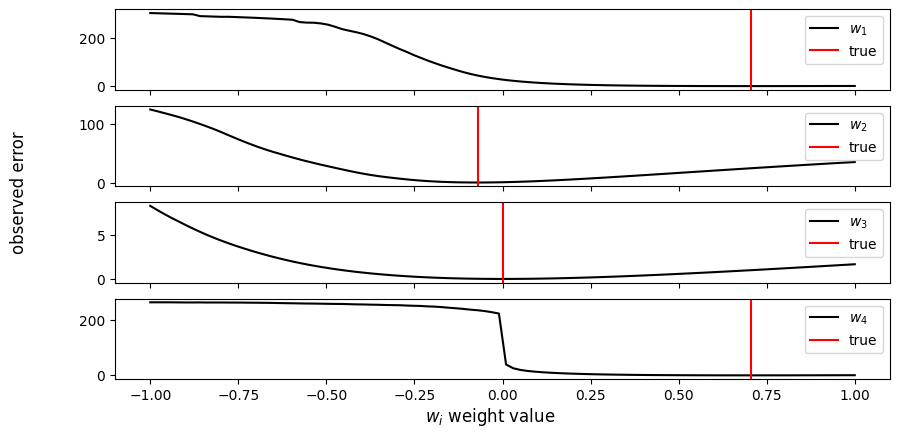
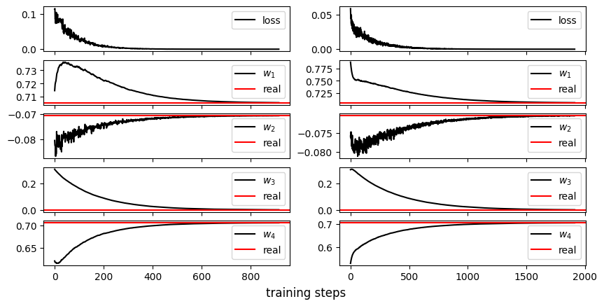
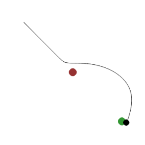
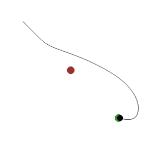
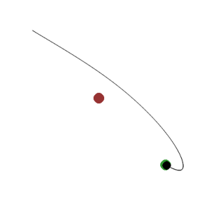

#  Inverse Optimal Control and Model Predictive Control for Autonomous Decision Making Under Timely Distributional Shift

This repository includes codes, images and files generated in the project entitled "Inverse Optimal Control and Model Predictive Control for Autonomous Decision Making Under Timely Distributional Shift", where we discuss why we need to make Learning Agents able to act in a robust manner even under continuously updating environments.

In this project we show how conjoint techniques from the field of Optimal Control Theory (namely, Inverse Optimal Control and Model Predictive Control) can be used to reach good generization and adaptability properties even under environmental timely  distributional shift.

## Inverse Optimal Control for Learning from Demonstrations

Loss Structure:

Learning Logs:

## Model Predictive Control for Adaptive Autonomous Motion

Results using MPC

